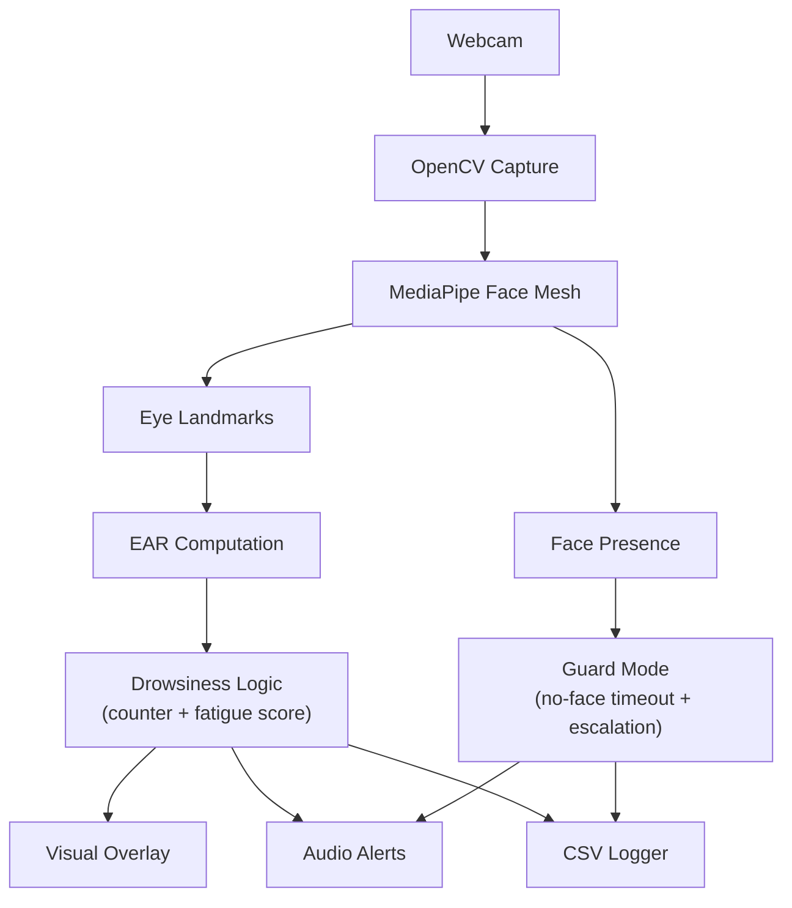

## Guard Fatigue Monitor

[](./LICENSE.md)


Real-time computer-vision monitor for security guard fatigue. Tracks eye landmarks with MediaPipe + OpenCV, computes the Eye Aspect Ratio (EAR), and raises audible/visual alerts with optional CSV event logs.

### Table of contents
- [Features](#features)
- [Requirements](#requirements)
- [Demo](#demo)
- [Support matrix](#support-matrix)
- [Quick start](#quick-start)
- [Usage](#usage)
- [CLI flags](#cli-flags)
- [Architecture](#architecture)
- [Algorithm](#algorithm)
- [Configuration defaults](#configuration-defaults)
- [Event log format](#event-log-format)
- [Troubleshooting](#troubleshooting)
- [Development and testing](#development-and-testing)
- [Project structure](#project-structure)
- [Roadmap](#roadmap)
- [Contributing](#contributing)
- [FAQ](#faq)
- [Known limitations](#known-limitations)
- [Privacy](#privacy)
- [License](#license)
- [Acknowledgements](#acknowledgements)

## Features
- **EAR-based fatigue scoring** with recovery/decay to resist false alarms from brief blinks
- **On-screen overlays** showing EAR, fatigue score, and eye polylines
- **Audible alerts** with periodic beeps and an escalation tone for prolonged events
- **Guard Mode** to alert when no face is detected for a timeout
- **CSV event logging** for audits and analytics

## Requirements
- **Python**: 3.8+
- **OS**: macOS, Windows, or Linux
- **Hardware**: integrated or USB webcam (IR/NIR recommended in low light)

## Demo

<video src="video/Screen Recording 2025-08-24 at 9.31.17 PM.mov" controls width="720">
  Your browser does not support the video tag. Watch the demo video instead:
  <a href="video/Screen Recording 2025-08-24 at 9.31.17 PM.mov">download/view .mov</a>.
</video>

Note: GitHub’s markdown renderer may not inline-play `.mov` files in all browsers. If playback doesn’t appear, use the download link above.

## Support matrix

| Component | Supported | Notes |
|---|---|---|
| Python | 3.8 – 3.12 | CI-tested locally; 3.13+ may work but not guaranteed |
| macOS | 12+ | Grant Camera permissions to your terminal/app |
| Windows | 10/11 | Standard USB/integrated webcams |
| Linux | Ubuntu 20.04+/Debian 12+ | Ensure access to `/dev/video*` |
| Camera | Integrated/USB | IR/NIR recommended for low light |

## Quick start
```bash
python3 -m venv .venv
source .venv/bin/activate  # Windows: .venv\Scripts\activate
pip install --upgrade pip
pip install -r requirements.txt

# Launch (windowed)
python guard_fatigue_detection.py
```

## Usage
```bash
# Guard Mode (windowed) with CSV logging
python guard_fatigue_detection.py --guard --log guard_events.csv

# Guard Mode fullscreen
python guard_fatigue_detection.py --guard --fullscreen --log guard_events.csv

# Headless (no window), alerts + logging only
python guard_fatigue_detection.py --guard --headless --log guard_events.csv
```
- Press `q` to quit when running with a window.

### CLI flags

| Flag | Type | Default | Description |
|---|---|---|---|
| `--guard` | bool | `false` | Enable Guard Mode (no-face timeout + escalation) |
| `--headless` | bool | `false` | Run without GUI window (audio alerts + logging only) |
| `--fullscreen` | bool | `false` | Open the window in fullscreen (if supported) |
| `--log PATH` | string | none | Append CSV events to `PATH` |

## Architecture



## Algorithm

- Eye Aspect Ratio (EAR) measures eye openness using distances between landmarks.
- Define vertical distances: \(A\) and \(B\), and horizontal distance: \(C\). EAR is:

\[\text{EAR} = \frac{A + B}{2C}\]

- If \(\text{EAR} < \text{EAR\_THRESH}\) for consecutive frames, we increment a counter and increase a fatigue score. When either the counter exceeds \(\text{CLOSED\_EYES\_FRAME}\) or the fatigue score exceeds \(\text{fatigue\_alert\_threshold}\), an alert triggers. When attentive again, the fatigue score decays each frame.
- Guard Mode raises an alert if no face is detected for \(\text{no\_face\_timeout\_seconds}\); after an additional \(\text{escalation\_seconds}\), the alert escalates.

## Configuration defaults
Adjust these values in `guard_fatigue_detection.py` if you need different behavior.

```python
# Eye/alert thresholds
EAR_THRESH = 0.25
CLOSED_EYES_FRAME = 20

# Audio
beep_interval_seconds = 1.0
sample_rate = 44100

# Fatigue scoring
fatigue_increase_per_frame = 2.0
fatigue_decay_per_frame = 1.0
fatigue_alert_threshold = 60.0

# Guard Mode
no_face_timeout_seconds = 10.0
escalation_seconds = 60.0
```

## Event log format
When `--log` is provided, events are appended to CSV:
```csv
timestamp,event
2025-01-01 12:00:00,FATIGUE_ALERT
2025-01-01 12:01:10,NO_FACE_ALERT
```

## Troubleshooting
- **Green camera light but no window**: remove `--headless`. Headless intentionally suppresses visuals.
- **Window not visible (macOS)**: check Mission Control; grant Terminal Camera access (Settings → Privacy & Security → Camera).
- **“Could not open camera”**: ensure no other app is using the webcam. On Linux, verify permissions for `/dev/video*`.
- **No audio**: confirm output device/volume. Uses `sounddevice` when available; on macOS falls back to `afplay`.

## Development and testing
```bash
pip install -r requirements-dev.txt
pytest -v
```

## Project structure
```text
guard-fatigue-monitor/
  guard_fatigue_detection.py   # main application
  guard_events.csv             # runtime log (if --log is used)
  tests/                       # unit tests
  requirements.txt             # runtime deps
  requirements-dev.txt         # dev/test deps
  README.md
```

## Roadmap
- Configurable thresholds via CLI or config file
- On-disk snapshots on alert, and optional syslog/webhook integrations
- Multi-person support and basic anti-spoof checks

## Contributing
Issues and PRs are welcome. Please:
- Run the test suite: `pytest -v`
- Keep code readable and consistent with existing style

## FAQ
- **Why do I hear beeps but see no window?** You likely ran with `--headless`. Remove it to see the GUI.
- **How do I stop the app?** Press `q` in the windowed mode, or terminate the process in headless mode.
- **Can I change thresholds without editing code?** Not yet; see Roadmap for CLI/config support.
- **Does it work with multiple people?** Designed for a single, closest face. See Known limitations.

## Known limitations
- Performance and accuracy depend on lighting, camera quality, and head pose.
- Strong occlusions (hands, masks, heavy glasses glare) can reduce landmark quality.
- Single-person focus; multi-face prioritization is not implemented.
- No anti-spoof or identity verification.

## Privacy
All video processing happens locally. If enabled, CSV logs store only timestamps and event labels. Review, rotate, and protect logs per your policy.

## License
MIT — see `LICENSE.md`.

## Acknowledgements
- [MediaPipe Face Mesh](https://developers.google.com/mediapipe/solutions/vision/face_landmarker)
- [OpenCV](https://opencv.org/)